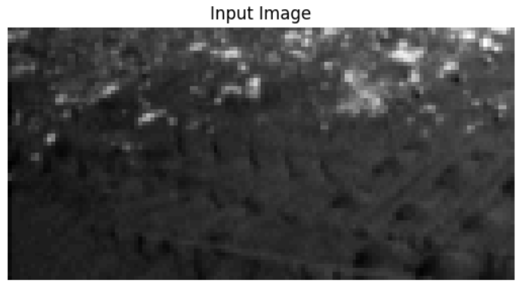

## Mars Terrain Segmentation

This challenge involved segmenting Mars surface images into five classes: **Background, Soil, Bedrock, Sand, and Big Rocks**. We built a deep neural newtork from scratch, as per the assignment requirements.

Mars terrain segmentation is challenging due to strong class imbalance, low-resolution grayscale imagery, and subtle visual differences between terrain types, especially for small and rare structures such as Big Rocks. Moreover, images were provided in black and white.

While designing and implementing our solution, we explored:
- Dataset cleaning and analysis
- Data augmentation
- Custom semantic segmentation architectures
- Hyperparameter tuning
- Loss engineering

For this assignment, transfer learning was not allowed.
The model performance was evaluated using Mean Intersection over Union (MeanIOU) on a private test set.

## Libraries

The core implementation was developed using TensorFlow Keras. We also used NumPy, Matplotlib, and Seaborn for secondary purposes.
Additional experiments with alternative architectures were conducted using PyTorch. We also used Optuna for automated hyperparameter optimization.

## More Info

Refer to the [report](report.pdf) and [notebooks](/notebooks).

## Team

I thank my colleagues and friends [Matteo Salari](https://github.com/matteo-salari), [Davide Salonico](https://github.com/DavideSalonico) and [Federica Topazio](https://github.com/federicatopazio) who worked with me on this project.
